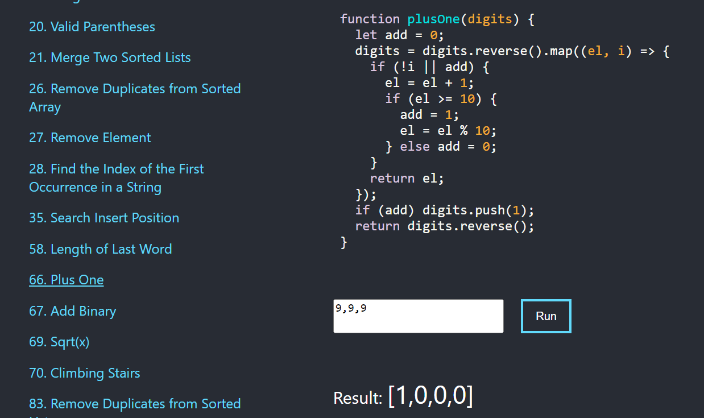

# 🚥 Leetcode problem solving with test checking function 🚥

### The application demonstrates solutions to some problems from leetcode.com and allows you to run tests on them.



## Live demo

[https://leetcode.solutions4web.ru/](https://leetcode.solutions4web.ru)

## Main Libraries

- React
- Typescript
- Saas

## Installation

```shell
# clone this repository
$ git clone https://github.com/leopard-work/leetcode

# go into project directory
$ cd MDShop

# install dependencies
$ npm install
```

### Run dev server

```shell
$ npm run start
```

Run dev server on [http://localhost:3000](http://localhost:3000)

### Build

```shell
$ npm run build
```